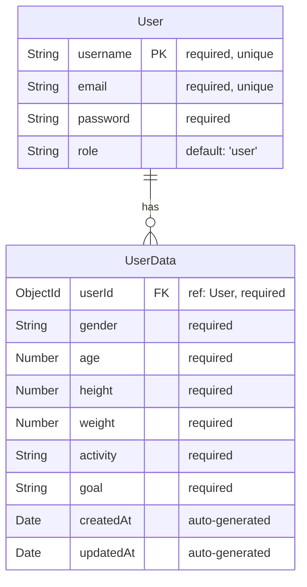

```mermaid
erDiagram
    User {
        String username PK "required, unique"
        String email "required, unique"
        String password "required"
        String role "default: 'user'"
    }

    UserData {
        ObjectId userId FK "ref: User, required"
        String gender "required"
        Number age "required"
        Number height "required"
        Number weight "required"
        String activity "required"
        String goal "required"
        Date createdAt "auto-generated"
        Date updatedAt "auto-generated"
    }

    User ||--o{ UserData : "has"
```